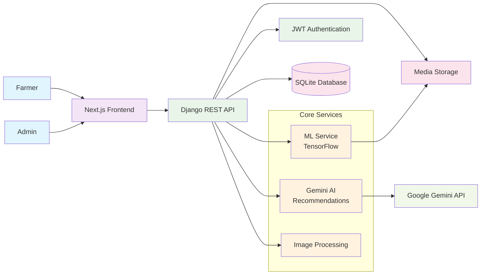

# FarmVille Backend Architecture Diagram (Mermaid)

```mermaid
graph LR
    %% External Users
    F[Farmer] 
    A[Admin]
    
    %% Frontend
    FE[Next.js Frontend]
    
    %% API Layer
    API[Django REST API]
    AUTH[JWT Authentication]
    
    %% Core Services
    subgraph "Core Services"
        ML[ML Service<br/>TensorFlow]
        AI[Gemini AI<br/>Recommendations]
        IMG[Image Processing]
    end
    
    %% Data Layer
    DB[(SQLite Database)]
    S3[Media Storage]
    
    %% External Services
    GEMINI[Google Gemini API]
    
    %% Connections
    F --> FE
    A --> FE
    FE --> API
    API --> AUTH
    API --> ML
    API --> AI
    API --> IMG
    API --> DB
    API --> S3
    AI --> GEMINI
    ML --> S3
    
    %% Styling
    classDef user fill:#e1f5fe
    classDef frontend fill:#f3e5f5
    classDef api fill:#e8f5e8
    classDef service fill:#fff3e0
    classDef data fill:#fce4ec
    classDef external fill:#f1f8e9
    
    class F,A user
    class FE frontend
    class API,AUTH api
    class ML,AI,IMG service
    class DB,S3 data
    class GEMINI external
```
