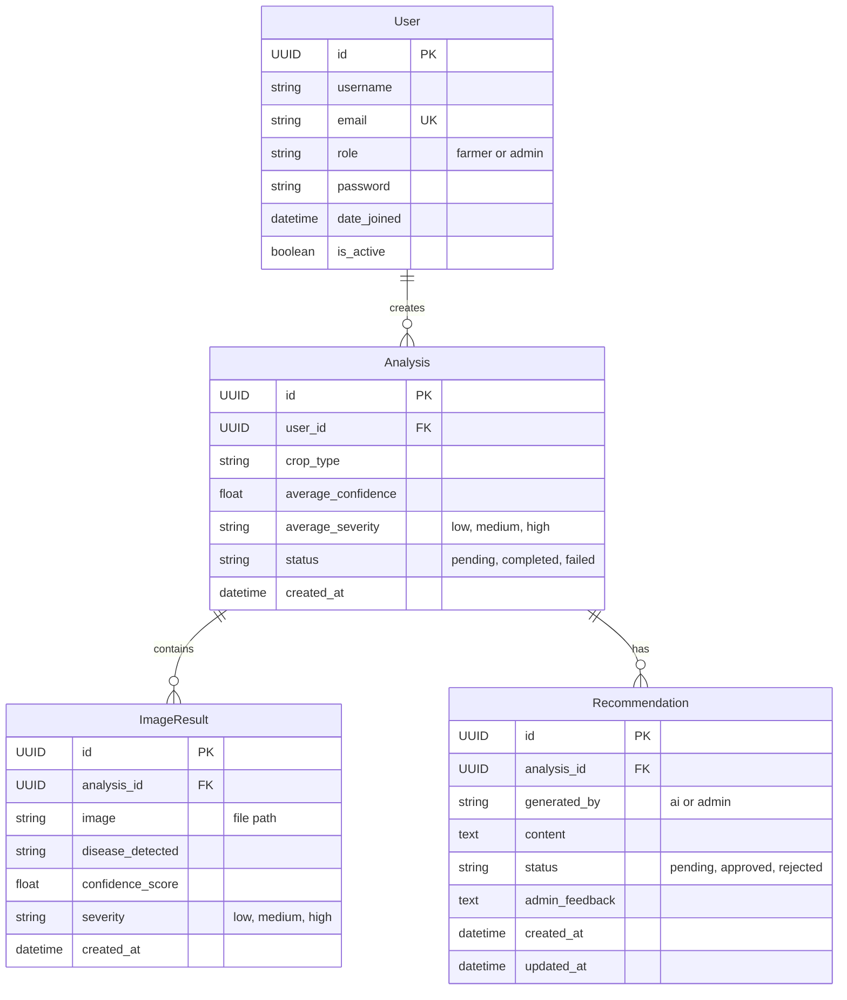

# FarmVille Database Schema Diagram (Mermaid)

```mermaid
erDiagram
    User {
        UUID id PK
        string username
        string email UK
        string role "farmer or admin"
        string password
        datetime date_joined
        boolean is_active
    }
    
    Analysis {
        UUID id PK
        UUID user_id FK
        string crop_type
        float average_confidence
        string average_severity "low, medium, high"
        string status "pending, completed, failed"
        datetime created_at
    }
    
    ImageResult {
        UUID id PK
        UUID analysis_id FK
        string image "file path"
        string disease_detected
        float confidence_score
        string severity "low, medium, high"
        datetime created_at
    }
    
    Recommendation {
        UUID id PK
        UUID analysis_id FK
        string generated_by "ai or admin"
        text content
        string status "pending, approved, rejected"
        text admin_feedback
        datetime created_at
        datetime updated_at
    }
    
    %% Relationships
    User ||--o{ Analysis : "creates"
    Analysis ||--o{ ImageResult : "contains"
    Analysis ||--o{ Recommendation : "has"
```
