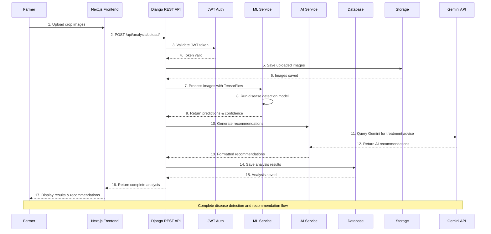

# FarmVille Disease Detection Sequence Diagram (Mermaid)

```mermaid
sequenceDiagram
    participant F as Farmer
    participant FE as Next.js Frontend
    participant API as Django REST API
    participant AUTH as JWT Auth
    participant ML as ML Service
    participant AI as AI Service
    participant DB as Database
    participant S3 as Storage
    participant G as Gemini API
    
    F->>FE: 1. Upload crop images
    FE->>API: 2. POST /api/analysis/upload/
    API->>AUTH: 3. Validate JWT token
    AUTH-->>API: 4. Token valid
    API->>S3: 5. Save uploaded images
    S3-->>API: 6. Images saved
    API->>ML: 7. Process images with TensorFlow
    ML->>ML: 8. Run disease detection model
    ML-->>API: 9. Return predictions & confidence
    API->>AI: 10. Generate recommendations
    AI->>G: 11. Query Gemini for treatment advice
    G-->>AI: 12. Return AI recommendations
    AI-->>API: 13. Formatted recommendations
    API->>DB: 14. Save analysis results
    DB-->>API: 15. Analysis saved
    API-->>FE: 16. Return complete analysis
    FE-->>F: 17. Display results & recommendations
    
    Note over F,G: Complete disease detection and recommendation flow
```
