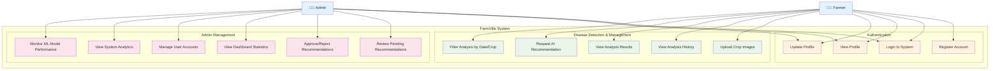

# FarmVille Use Case Diagram (Mermaid)

```mermaid
graph TB
    %% Actors
    F[👨‍🌾 Farmer]
    A[👨‍💼 Admin]
    
    %% System boundary
    subgraph "FarmVille System"
        %% Authentication Use Cases
        subgraph "Authentication"
            UC1[Register Account]
            UC2[Login to System]
            UC3[View Profile]
            UC4[Update Profile]
        end
        
        %% Farmer Use Cases
        subgraph "Disease Detection & Management"
            UC5[Upload Crop Images]
            UC6[View Analysis History]
            UC7[View Analysis Results]
            UC8[Request AI Recommendation]
            UC9[Filter Analysis by Date/Crop]
        end
        
        %% Admin Use Cases
        subgraph "Admin Management"
            UC10[Review Pending Recommendations]
            UC11[Approve/Reject Recommendations]
            UC12[View Dashboard Statistics]
            UC13[Manage User Accounts]
            UC14[View System Analytics]
            UC15[Monitor ML Model Performance]
        end
    end
    
    %% Farmer connections
    F --> UC1
    F --> UC2
    F --> UC3
    F --> UC4
    F --> UC5
    F --> UC6
    F --> UC7
    F --> UC8
    F --> UC9
    
    %% Admin connections
    A --> UC2
    A --> UC3
    A --> UC4
    A --> UC10
    A --> UC11
    A --> UC12
    A --> UC13
    A --> UC14
    A --> UC15
    
    %% Styling
    classDef actor fill:#e3f2fd
    classDef usecase fill:#f1f8e9
    classDef auth fill:#fff3e0
    classDef farmer fill:#e8f5e8
    classDef admin fill:#fce4ec
    
    class F,A actor
    class UC1,UC2,UC3,UC4 auth
    class UC5,UC6,UC7,UC8,UC9 farmer
    class UC10,UC11,UC12,UC13,UC14,UC15 admin
```
